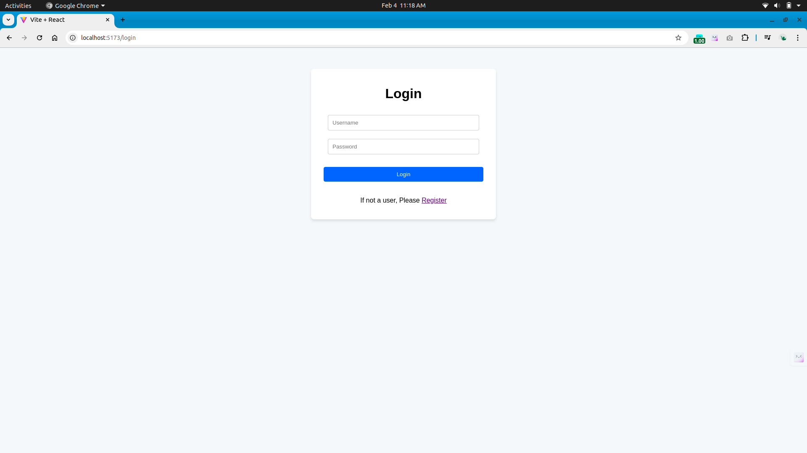
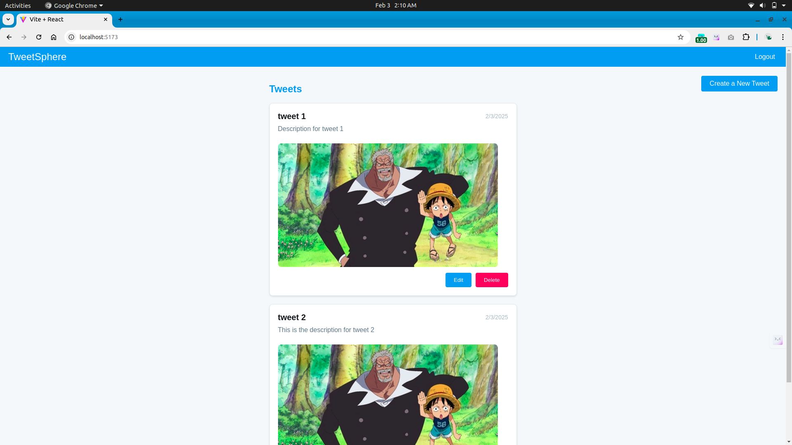
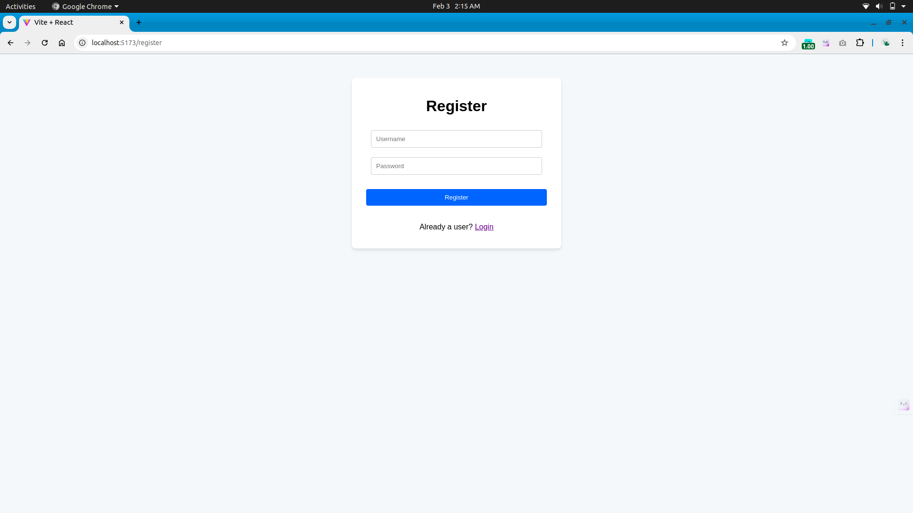

# TweetSphere

A modern social media web application that provides Twitter-like functionality with a clean, intuitive interface.

## Overview

TweetSphere is a full-stack web application built with React and Django that enables users to engage in social networking through tweet creation, interaction, and user authentication. The platform offers a responsive design that works seamlessly across all devices.

## Features

- **User Management**
  - Secure authentication and authorization
  - User profile creation and customization
  - Password reset functionality

- **Tweet Operations**
  - Create and publish tweets
  - Edit existing tweets
  - Delete tweets
  - Rich text formatting support

- **User Interface**
  - Responsive design for mobile and desktop
  - Dark/light mode toggle
  - Real-time updates
  - Infinite scroll for tweet feed

## Technology Stack

### Frontend
- React.js
- Tailwind CSS
- Vite
- Axios for API calls

### Backend
- Django
- Django REST Framework
- PostgreSQL
- JWT Authentication

## Prerequisites

Before you begin, ensure you have the following installed:
- Node.js (v16 or higher)
- Python (v3.8 or higher)
- PostgreSQL
- Git

## Installation

### 1. Clone the Repository
```bash
git clone https://github.com/yourusername/tweetsphere.git
cd tweetsphere
```

### 2. Backend Setup
```bash
# Navigate to backend directory
cd backend

# Create and activate virtual environment
python -m venv venv
source venv/bin/activate  # On Windows: venv\Scripts\activate

# Install dependencies
pip install -r requirements.txt

# Configure environment variables
cp .env.example .env
# Edit .env with your database credentials

# Run migrations
python manage.py makemigrations
python manage.py migrate

# Start Django server
python manage.py runserver
```

### 3. Frontend Setup
```bash
# Navigate to frontend directory
cd frontend

# Install dependencies
npm install

# Start development server
npm run dev
```

## Usage

### Accessing the Application
- Backend API: [http://127.0.0.1:8000/](http://127.0.0.1:8000/)
- Frontend App: [http://localhost:5173/](http://localhost:5173/)

### Available Scripts

Backend:
```bash
python manage.py test        # Run tests
python manage.py createsuperuser  # Create admin user
```

Frontend:
```bash
npm run build    # Build for production
npm run lint     # Run linter
npm run test     # Run tests
```

## Screenshots

### Login Dashboard

*User authentication interface with secure login functionality*

### Home Dashboard

*Main interface showing tweet feed and interaction options*

### Logout Dashboard

*Logout confirmation and session management*

## Contributing

1. Fork the repository
2. Create your feature branch (`git checkout -b feature/AmazingFeature`)
3. Commit your changes (`git commit -m 'Add some AmazingFeature'`)
4. Push to the branch (`git push origin feature/AmazingFeature`)
5. Open a Pull Request

## Support

For support, please open an issue in the GitHub repository or contact the development team.

## Acknowledgments

- Thanks to all contributors who have helped shape TweetSphere
- Special thanks to the React and Django communities for their excellent documentation